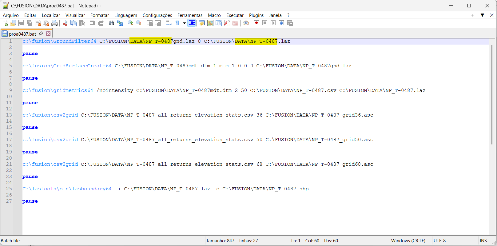
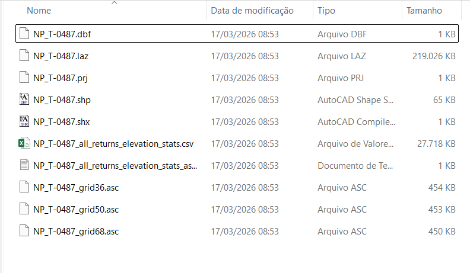
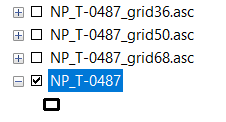
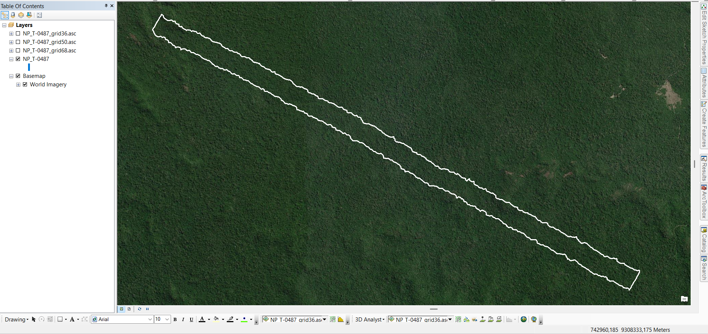
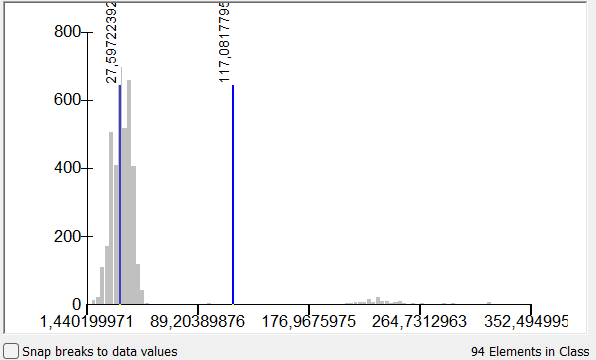
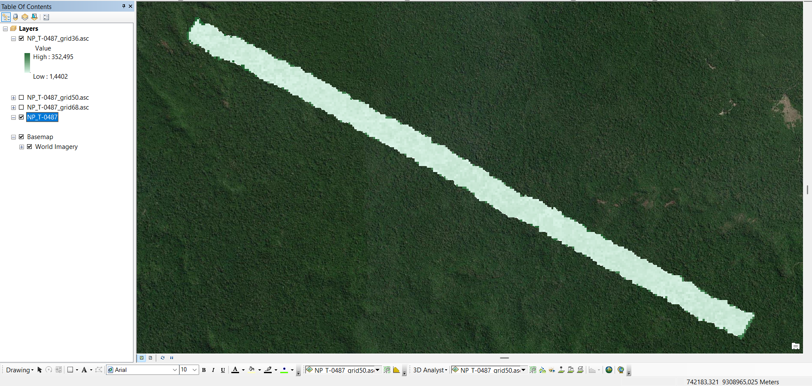
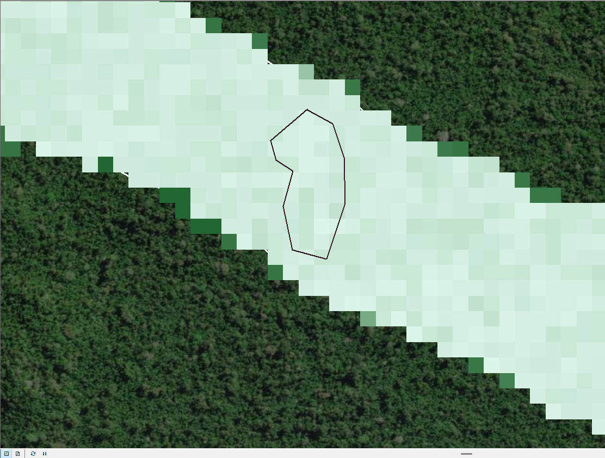
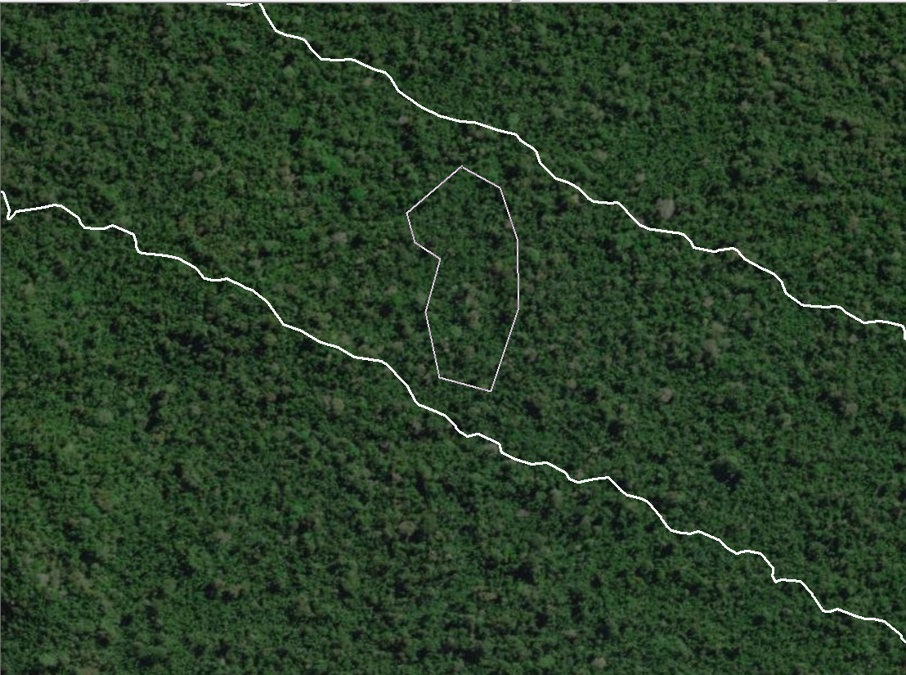

# 📊 Processamento de Dados LiDAR

## 📑 Índice

- [1. Objetivo](#1--objetivo)
- [2. Fontes de Dados](#2--fontes-de-dados)
- [3. Instalação dos Softwares](#3-️-instalação-dos-softwares)
  - [3.1 Preparação do Ambiente](#31--preparação-do-ambiente)
  - [3.2 Ajustes no FUSION](#32--ajustes-no-fusion-suporte-a-laz)
- [4. Processamento dos Dados](#4-️-processamento-dos-dados)
- [5. Verificação no GIS](#5-️-verificação-no-gis)
- [6. Armazenamento](#️6-armazenamento)

## 1. Objetivo

Estabelecer um procedimento padronizado para **download, organização e processamento básico de dados LiDAR**, visando a geração de produtos derivados da nuvem de pontos para análises ambientais e florestais.

### Produtos finais

- Métricas LiDAR (`.CVC` ou `.CSV`)
- Modelos raster (**DTM** e **CHM**)
- Arquivo vetorial de limite da área (**Shapefile**)

---

## 2. Fontes de Dados

Os dados LiDAR devem ser obtidos preferencialmente nas seguintes fontes:

- Serviço Florestal Brasileiro (**SFB**)
- Projeto Paisagens Sustentáveis Brasil – Embrapa (**PSB**)
- Projeto Estimativa de Biomassa da Amazônia (**EBA**)

### Formatos disponíveis

- `.LAS` (formato padrão LiDAR)
- `.LAZ` (formato comprimido)

### Dados complementares obrigatórios

- Metadados do levantamento  
- Informações de projeção  
- Descrição da missão LiDAR  

---

## 3. Instalação dos Softwares

Antes de iniciar o processamento, instale:

- **FUSION** – processamento LiDAR  
  https://forsys.sefs.uw.edu/fusion/fusionlatest.html  

- **LAStools** – manipulação e conversão  
  https://lastools.github.io/  

- **Notepad++** – edição de scripts  
  https://notepad-plus-plus.org/downloads/  

---

## 3.1 Preparação do Ambiente

Certifique-se de que os softwares estejam instalados:

- FUSION  
- LAStools  

📌 Recomenda-se instalar diretamente no diretório raiz:

C:\FUSION
C:\LAStools

---

## 3.2 Ajustes no FUSION (Suporte a .LAZ)

O **FUSION (versão 3.40 ou superior)** suporta arquivos `.LAZ` via biblioteca **LASzip**.

### Passos:

1. Localize os arquivos no diretório do LAStools:

LASzip.dll
LASzip64.dll

2. Copie para:
C:\FUSION

✅ Após isso, o FUSION reconhecerá arquivos `.LAZ` sem necessidade de conversão.

> ⚠️ **Nota importante**  
> Sempre verifique os sites oficiais dos desenvolvedores. Atualizações ou dependências extras podem ser necessárias.

---

## 4. Processamento dos Dados

O processamento é realizado via script no Prompt de Comando (MS-DOS).

### 📄 Arquivo do script : proa.txt

Renomear para:
proa.bat

---

### Configuração do Script

- Edite no **Notepad++**
- Atualize o caminho do arquivo LiDAR em **todas as linhas**
- Utilize:
Ctrl + F → Localizar e Substituir

---

### Saída esperada

Se o processamento ocorrer corretamente, os arquivos serão gerados em:
C:\FUSION\DATA

---

 Print da tela do ProA.bat com o script

O item em destaque em amarelo é o caminho que deve ser alterado toda a vez que for rodar um novo processamento.Esse caminho é onde estará o seu arquivo e o nome do arquivo que será processado. Ele deve ser substituído em todas as linhas do script e pode ser usado o atalho Ctrl + F para “localizer e substituir”

Se tudo processor corretamente, deverão ter os seguintes arquivos gerados na pasta indicada (“C:\FUSION\DATA” para a situação acima)

 Print da lista de arquivos gerados a partir do “NP_T-0478.Laz” e do srcitp utilizado acima

---

## 5. Verificação no GIS

Abrir os arquivos em um programa GIS (QGis ou ArcGis) para validar os arquivos gerados. Abaixo os itens que devem ser avaliados no programa. Verificar DATUM para que seja aberto de forma correta no programa. Nesse caso o Transecto é da Flona Altamira, FUSO 21S.

Abra os dados em:

- QGIS  
- ArcGIS

 
Print dos arquivos que deverão ser validados no programa GIS

### Verificações importantes

Deverá ser aberto o shapefile do transescto bem como os 03 rasters gerados para cada grid (36, 50 e 68). As informações relacionadas aos resultados “grids” podem ser consultados no “FUSION_manual.pdf” que se encontra em “C:\FUSION\doc”.

- Sistema de coordenadas (DATUM)
- Fuso (ex: 21S)
- Área correta (ex: Flona Altamira)

 Print tela ArcGis - Shapefile do Transecto

Avaliando o Grid 36 que seria as alturas das árvores. Fazer uma reclassificaçao e modificar cores para melhor visualização a análise.

 Print tela ArcGis - distribuição valores altura

 Print tela ArcGis - Reclassificação cores - raster altura

---

### Dados a validar

- Shapefile do transecto  
- Rasters gerados (grids):

| Grid | Descrição |
|------|----------|
| 36 | Elevação P90 |
| 50 | Percentual de retornos acima do heightbreak |
| 68 | Canopy Relief Ratio |

📘 Consulte: C:\FUSION\doc\FUSION_manual.pdf

---

### Conferência Final

- Validar os grids: 36, 50 e 68  
- Comparar com imagem de satélite  
- Verificar coerência dos dados

Dando um ZOOM em determindo ponto apenas para verificar os pontos mais altos com possiveis arvores mais altas na imagem de satélite.

  
Print para conferencia de dados gerados para realidade de imagem satélite - altura árvores

---

## 6. Armazenamento

Se os resultados estiverem corretos:

Subir os arquivos para o Drive compartilhado organizando por:

- Transecto  
- Área de estudo  
- Ano  
