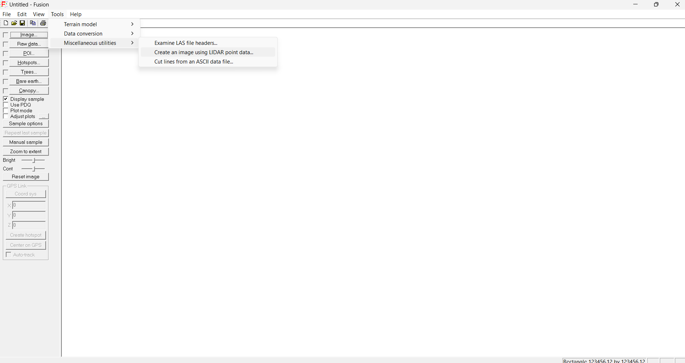
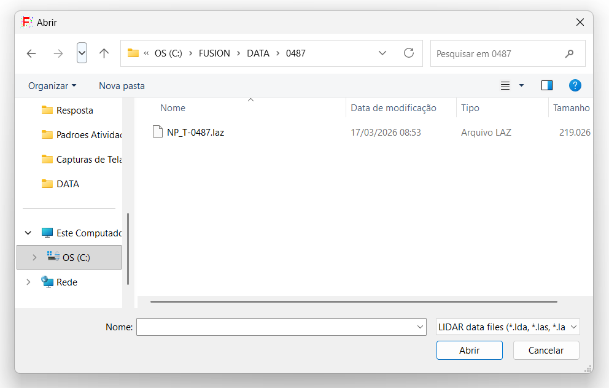
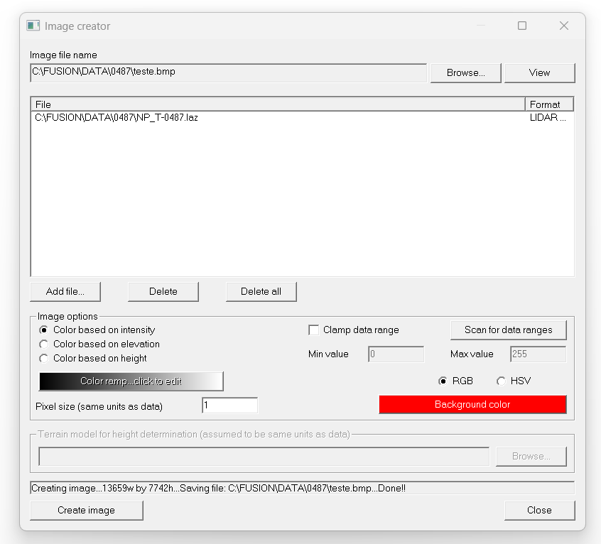
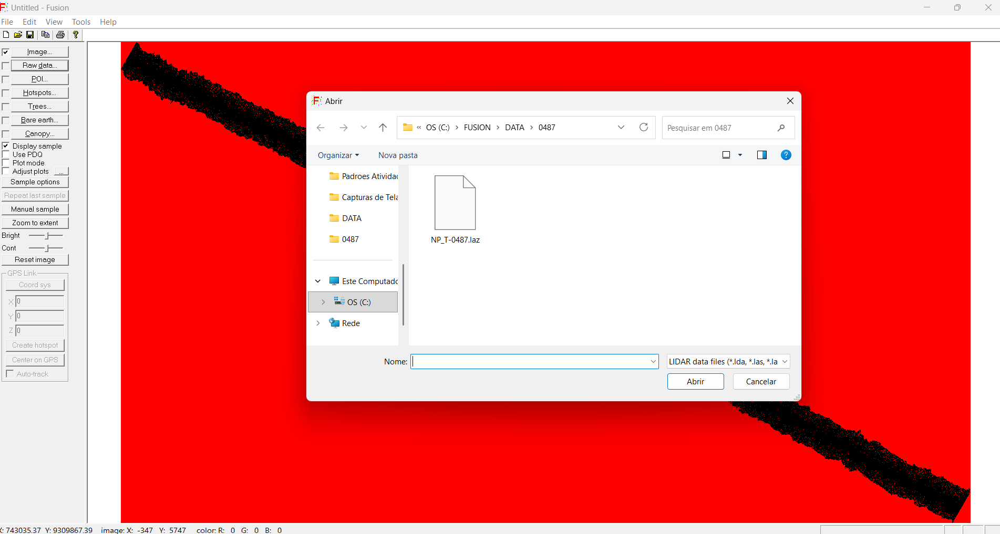
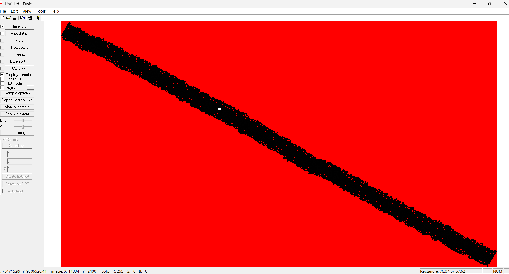
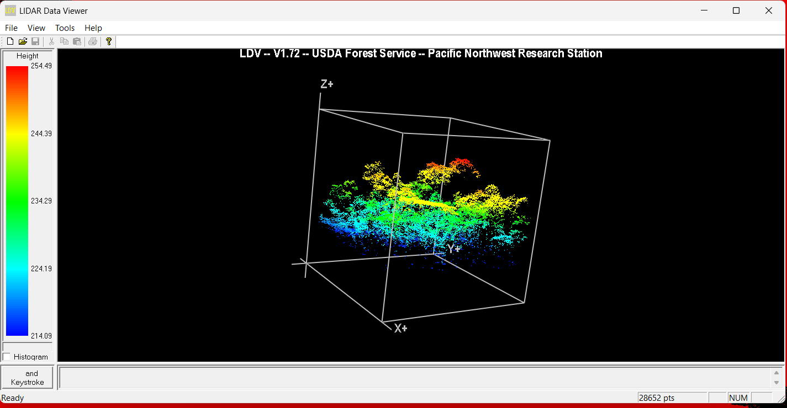
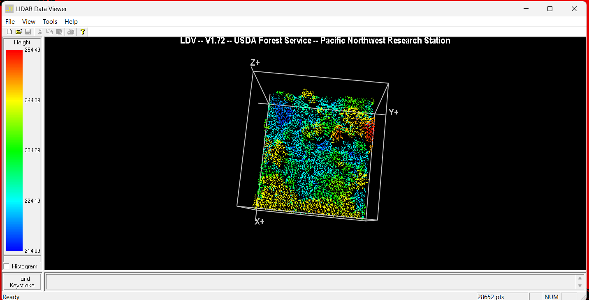
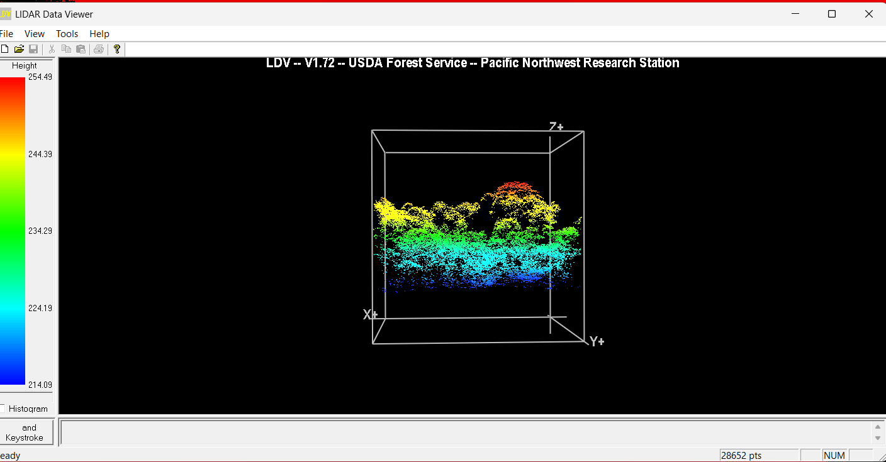

  
  &nbsp;&nbsp;&nbsp;&nbsp;
  

<h1 align="center">Processamento de Dados LiDAR</h1>

---

## Índice

- [1. Objetivo](#1--objetivo)
- [2. Fontes de Dados](#2--fontes-de-dados)
- [3. Instalação dos Softwares](#3-instalação-dos-softwares)
  - [3.1 Preparação do Ambiente](#31--preparação-do-ambiente)
  - [3.2 Ajustes no FUSION](#32--ajustes-no-fusion-suporte-a-laz)
- [4. Avaliação Prévia da Nuvem de Pontos (FUSION)](#4-avaliação-prévia-da-nuvem-de-pontos-fusion)
- [5. Processamento dos Dados](#5-processamento-dos-dados)
- [6. Verificação no GIS](#6-verificação-no-gis)
- [7. Armazenamento](#7-armazenamento)

---

## 1. Objetivo

Estabelecer um procedimento padronizado para **download, organização e processamento de dados LiDAR**, com foco na geração de produtos derivados da nuvem de pontos para análises ambientais e florestais.

### Produtos finais

- Métricas LiDAR (`.CVC` ou `.CSV`)  
- Modelos raster (**DTM** e **CHM**)  
- Arquivo vetorial (**Shapefile**)  

---

## 2. Fontes de Dados

Os dados LiDAR devem ser obtidos, preferencialmente, a partir das seguintes instituições:

- Serviço Florestal Brasileiro (**SFB**)  
- Projeto Paisagens Sustentáveis Brasil – Embrapa (**PSB**)  
- Projeto Estimativa de Biomassa da Amazônia (**EBA**)  

### Formatos disponíveis

- `.LAS` (formato padrão)  
- `.LAZ` (formato comprimido)  

### Dados complementares obrigatórios

- Metadados  
- Sistema de projeção  
- Informações da missão LiDAR  

---

## 3. Instalação dos Softwares

Instalar previamente:

- **FUSION** – processamento LiDAR  - Link: https://forsys.sefs.uw.edu/fusion/fusionlatest.html
- **LAStools** – manipulação de dados - Link: https://lastools.github.io/  
- **Notepad++** – edição de scripts - Link: https://notepad-plus-plus.org/downloads/

## 3.1 Preparação do Ambiente

Recomenda-se instalar diretamente no diretório raiz:

*`C:\FUSION`*  
*`C:\LAStools`*

## 3.2 Ajustes no FUSION (Suporte a .LAZ)

O **FUSION (v3.40+)** suporta `.LAZ` via biblioteca **LASzip**.

### Procedimento

1. Localizar no LAStools:
   - `LASzip.dll`  
   - `LASzip64.dll`  

2. Copiar para:

*`C:\FUSION`*

✅ Após isso, arquivos `.LAZ` serão reconhecidos automaticamente.

> ⚠️ **Nota técnica**  
> Verifique atualizações nos sites oficiais dos desenvolvedores.

---

## 4. Avaliação Prévia da Nuvem de Pontos (FUSION)

Antes de iniciar o processamento dos dados LiDAR, recomenda-se realizar uma **avaliação visual da nuvem de pontos**, com o objetivo de verificar a integridade, densidade e consistência dos dados.

Essa etapa permite validar se o arquivo `.LAZ` possui qualidade adequada para processamento.

### 4.1 Abertura do FUSION

1. Executar o aplicativo **FUSION**  
2. Navegar até:

**Tools → Miscellaneous Utilities → Create an image using LiDAR point data**

  
   
  <b>Figura 9 – Print da tela do programa FUSION.</b>

### 4.2 Seleção do arquivo LiDAR

Após acessar a ferramenta, será aberta uma janela para seleção do arquivo `.LAZ`.

Selecionar o arquivo desejado e clicar em **Abrir**.

  
   
  <b>Figura 10 – Seleção do arquivo LiDAR (.LAZ).</b>

### 4.3 Definição da saída da imagem

Após abrir o arquivo:

- Definir o local de saída clicando em **Browse**  
- Escolher o diretório e nome do arquivo de imagem  

Em seguida:

- Iniciar o processamento da imagem  
- Aguardar a finalização  

Ao término, será exibida a mensagem **“Done”** no rodapé da tela.

---

  
   
  <b>Figura 11 – Tela para configuração e geração da imagem.</b>

### 4.4 Visualização da nuvem de pontos (Raw Data)

Após a geração da imagem:

1. Clicar em **Close**  
2. Selecionar a opção **Raw Data** no menu superior  
3. Abrir novamente o arquivo `.LAZ`  

  
   
  <b>Figura 12 – Tela de acesso aos dados brutos (Raw Data).</b>

### 4.5 Seleção de área para análise

Com o arquivo carregado:

- Selecionar uma área da nuvem de pontos utilizando o cursor  
- Definir o tamanho da área de interesse  

> ⚠️ Áreas maiores demandam maior tempo de processamento.

  
   
  <b>Figura 13 – Seleção de uma porção do transecto para análise.</b>

### 4.6 Análise tridimensional dos dados

Após o processamento da área selecionada:

- Os dados serão exibidos em visualização tridimensional  
- É possível rotacionar a cena nos eixos **X, Y e Z**  
- Permite avaliar a estrutura da vegetação de forma mais realista  

  
  
  
   
  <b>Figura 14,15 e 16 – Avaliação da seção selecionada da nuvem de pontos em ambiente 3D.</b>

### 4.7 Validação dos dados

Com essa análise, é possível verificar:

- Presença de milhares de pontos LiDAR  
- Distribuição espacial coerente  
- Representação da vegetação  

Essa etapa garante que os dados possuem qualidade adequada para prosseguir com o processamento.

---

## 5. Processamento dos Dados

Processamento realizado via script no Prompt de Comando.

### Script

Arquivo original: `proa.txt`  
Renomear para: `proa.bat`

### Configuração

- Editar no **Notepad++**  
- Atualizar caminhos do arquivo LiDAR  
- Utilizar: `Ctrl + F → Substituir`

### Saída esperada

Arquivos gerados em:

*`C:\FUSION\DATA`*

  
   
  <b>Figura 1 – Script ProA.bat com destaque para o caminho do arquivo de entrada.</b>

O caminho destacado deve ser atualizado a cada execução.

  
   
  <b>Figura 2 – Arquivos gerados após o processamento LiDAR.</b>

---

## 6. Verificação no GIS

Validar os dados em ambiente SIG:

- QGIS  
- ArcGIS  

  
   
  <b>Figura 3 – Arquivos raster e vetoriais para validação.</b>

### Verificações obrigatórias

- Sistema de coordenadas (DATUM)  
- Fuso (ex: 21S)  
- Área correta (ex: Flona Altamira)  

  
   
  <b>Figura 4 – Shapefile do transecto no ArcGIS.</b>

### Análise dos dados

Grid 36 representa altura da vegetação. Recomenda-se reclassificação.

---

  
   
  <b>Figura 5 – Distribuição de valores de altura.</b>

  
   
  <b>Figura 6 – Reclassificação do raster.</b>

### Dados a validar

| Grid | Descrição |
|:----:|:---------:|
| 36 | Elevação P90 |
| 50 | Percentual acima do *heightbreak* |
| 68 | Canopy Relief Ratio |

📘 Referência:

*`C:\FUSION\doc\FUSION_manual.pdf`*

### Conferência final

- Validar grids (36, 50 e 68)  
- Comparar com imagens de satélite  
- Avaliar coerência dos dados  

  
  
   
  <b>Figura 7 e 8 – Comparação com imagem de satélite para validação da altura da vegetação.</b>

---

## 7. Armazenamento

Após validação, organizar os itens e "subir" os arquivos gerados e validados para a pasta no drive, conforme sua fonte, área de estudo, ano e código do transecto

---

